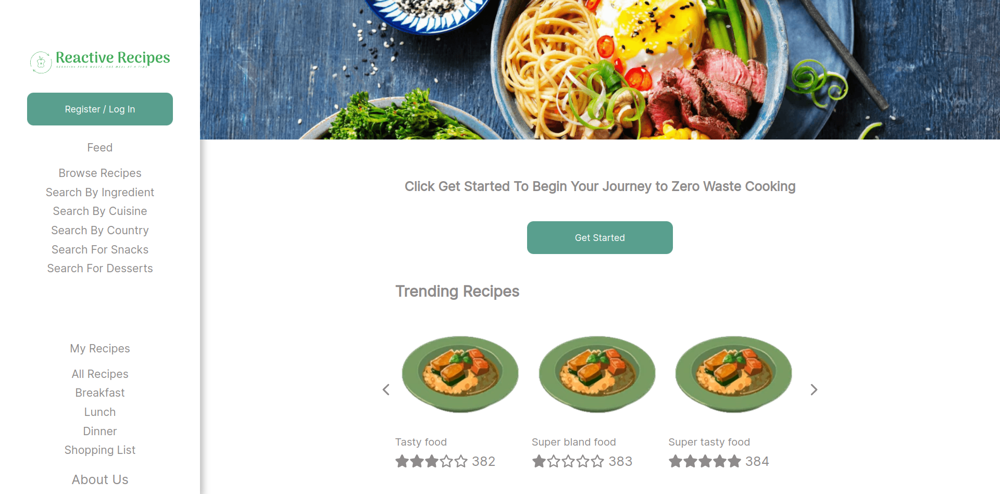

<div id="top"></div>
<!-- PROJECT LOGO -->
<br />
<div align="center">

<h3 align="center">Reactive Recipes</h3>

  <p align="center">
    Yet another recipes website but this time with a twist! 
    <br />
    <br />
    <br />
    <a href="https://github.com/THashimov/ReactiveRecipes/issues">Report Bug</a>
    ·
    <a href="https://github.com/THashimov/ReactiveRecipes/issues">Request Feature</a>
  </p>
</div>


<!-- TABLE OF CONTENTS -->
<details>
  <summary>Table of Contents</summary>
  <ol>
    <li>
      <a href="#about-the-project">About The Project</a>
      <ul>
        <li><a href="#built-with">Built With</a></li>
      </ul>
    </li>
    <li>
      <a href="#getting-started">Getting Started</a>
      <ul>
        <li><a href="#installation">Installation</a></li>
      </ul>
    </li>
    <li><a href="#roadmap">Roadmap</a></li>
    <li><a href="#contributing">Contributing</a></li>
    <li><a href="#license">License</a></li>
  </ol>
</details>


<!-- ABOUT THE PROJECT -->
## About The Project

Reactive recipes not only finds recipes for you but it will create a shopping list for you, grouping ingredients together so you know exactly how much you need to buy. There is a long roadmap on this project with many features to be implemented. The main feature being where a user can chose how many days worth of food they would like and Reactive Recipes will group lots of recipes that share ingredients, taking into the acount the average package size of a certain ingredient in order to reduce food waste. 



<p align="right">(<a href="#top">back to top</a>)</p>

### Built With

* [Rust](https://www.rust-lang.org/)
* [React](https://reactjs.org/)
* [MongoDB](https://www.mongodb.com/)

<p align="right">(<a href="#top">back to top</a>)</p>

<!-- GETTING STARTED -->
## Getting Started

There are a few dependancies so you will need rust, cargo and npm installed

### Installation

1. Clone the repo
   ```sh
   git clone git@github.com:THashimov/ReactiveRecipes.git
   ```
2. Install Rust 
   ```sh
   curl --proto '=https' --tlsv1.2 -sSf https://sh.rustup.rs | sh
   ```
3. Build the React project
   ```sh
   cd ReactiveRecipes/Frontend
   npm run build
   ```
4. Start the server
   ```sh
   cd ReactiveRecipes/Backend/server
   cargo run
   ```
<p align="right">(<a href="#top">back to top</a>)</p>

<!-- ROADMAP -->
## Roadmap

- [X] Save recipes to database
- [ ] Get saved recipes from database
- [ ] Get recipe by name from database 
- [ ] Search for recipes
- [ ] Rate a recipe
- [ ] Show recipes with common ingredients
- [ ] Generate a shopping list
- [ ] User login
- [ ] Add TLS


See the [open issues](https://github.com/THashimov/ReactiveRecipes/issues) for a full list of proposed features (and known issues).

<p align="right">(<a href="#top">back to top</a>)</p>

<!-- CONTRIBUTING -->
## Contributing

Contributions are what make the open source community such an amazing place to learn, inspire, and create. Any contributions you make are **greatly appreciated**.

If you have a suggestion that would make this better, please fork the repo and create a pull request. You can also simply open an issue with the tag "enhancement".
Don't forget to give the project a star! Thanks again!

1. Fork the Project
2. Create your Feature Branch (`git checkout -b feature/AmazingFeature`)
3. Commit your Changes (`git commit -m 'Add some AmazingFeature'`)
4. Push to the Branch (`git push origin feature/AmazingFeature`)
5. Open a Pull Request

<p align="right">(<a href="#top">back to top</a>)</p>

<!-- LICENSE -->
## License

Distributed under the MIT License. See `LICENSE.txt` for more information.

<p align="right">(<a href="#top">back to top</a>)</p>

<p align="right">(<a href="#top">back to top</a>)</p>


<!-- MARKDOWN LINKS & IMAGES -->
<!-- https://www.markdownguide.org/basic-syntax/#reference-style-links -->
[contributors-shield]: https://img.shields.io/github/contributors/github_username/repo_name.svg?style=for-the-badge
[contributors-url]: https://github.com/THashimov/ReactiveRecipes/graphs/contributors
[forks-shield]: https://img.shields.io/github/forks/github_username/repo_name.svg?style=for-the-badge
[forks-url]: https://github.com/THashimov/ReactiveRecipes/network/members
[issues-shield]: https://img.shields.io/github/issues/github_username/repo_name.svg?style=for-the-badge
[issues-url]: https://github.com/THashimov/ReactiveRecipes/issues
[license-shield]: https://img.shields.io/github/license/github_username/repo_name.svg?style=for-the-badge
[license-url]: https://github.com/THashimov/ReactiveRecipes/blob/main/LICENSE.txt
